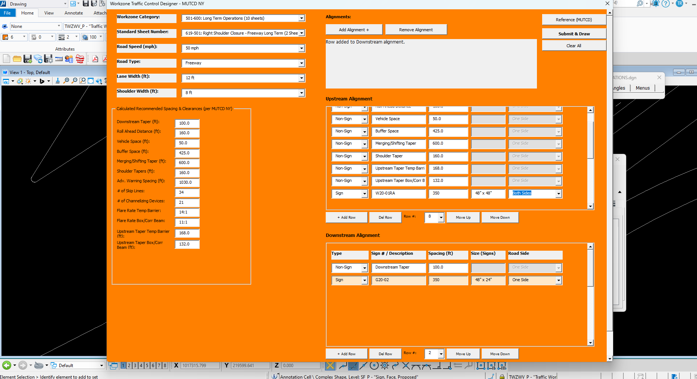
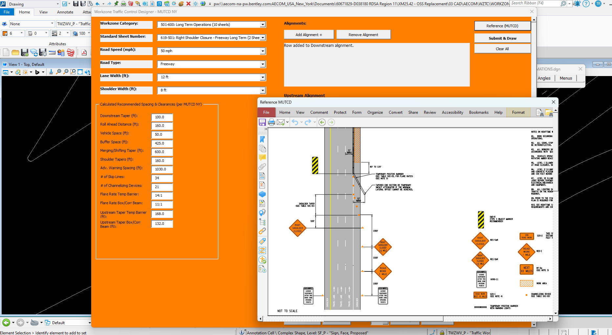
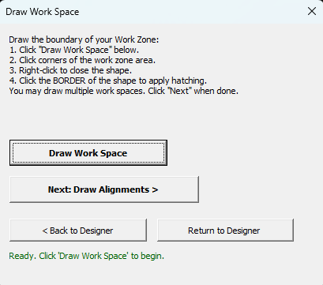
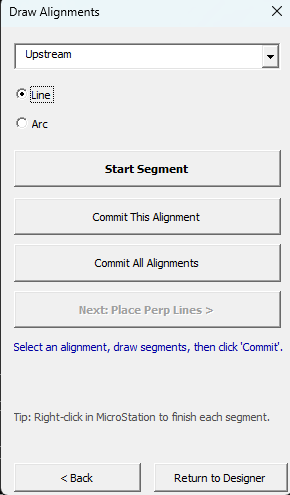
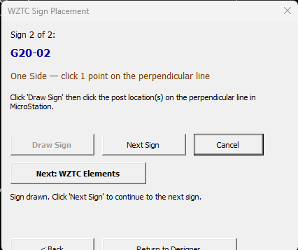
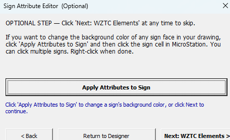
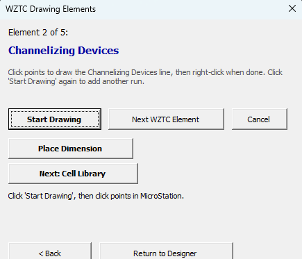
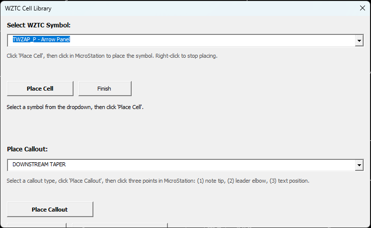

# NYSDOT Workzone Traffic Control Designer

A MicroStation tool that automates the creation of NYSDOT-compliant workzone traffic control plans. You fill in your project parameters once, draw your alignment, and the tool places every sign, taper marker, and element at the correct location — on the correct MicroStation level, with the correct spacing — automatically.

---

## Why Use This Tool

Preparing a workzone traffic control plan by hand in MicroStation is time-consuming and error-prone. It requires:

- Looking up spacing values in the NYSDOT Part 619 standard sheets and tables based on speed, road category, lane width, and shoulder width
- Drawing in cumulative distances and dimensions from scratch for every sign, taper, buffer zone, and work area marker
- Manually placing each sign face cell, sign post cell, connecting line, and text label one at a time from the cell library
- Switching MicroStation levels by hand for each element type, then switching back
- Keeping track of which signs go where in the .dgn file

This tool automates all of that. Here is what it does for you:

**Automatic spacing calculations.** Enter your road speed, lane width, and shoulder width and the tool immediately calculates every required spacing value — downstream taper length, roll-ahead distance, vehicle space, buffer space, merging taper, shoulder taper — directly from the NYSDOT standard tables. No manual lookup required.

**Built-in sign library with 500+ NYSDOT/MUTCD signs.** Type a sign number (for example, W20-01RA) and press Enter. The tool automatically fills in the correct sign size (Freeway or Non-Freeway) and recommended spacing. You never have to look up sign dimensions or search through the cell library manually.

**Standard 619 sheet viewer — right inside MicroStation.** You can open any NYSDOT Part 619 standard sheet directly in your MicroStation design file and mark it up as a reference while you work. Previously, engineers had to keep a separate PDF open and manually translate values into the drawing.

**Automatic element placement on the correct MicroStation levels.** Every element the tool places — sign faces, work space hatching, channelizing device lines, barriers, dimensions — is automatically placed on its correct NYSDOT level with the correct color and line weight. You never have to set these properties by hand or worry about forgetting to switch levels between elements.

**Automatic sign placement.** For each sign location, the tool places the sign face cell (the actual graphic from the NYSDOT cell library), the sign post cell, the connecting post line, and the text label with the sign number and size — all in one click. Without this tool, each of those four elements would need to be placed individually.

**Handles curved alignments.** The tool correctly walks along lines and arcs as a connected path, so perpendicular reference lines and sign locations are placed at the right arc-length distances even on curved roads.

**Multiple alignments in one session.** Define separate upstream and downstream alignments (or additional alignments for crossovers or complex setups) and work through each one in sequence.

**Repeatable, consistent results.** Every engineer using the tool for the same road parameters will get the same spacings and placements. There is no risk of forgetting a value or entering it in the wrong cell.

---

## What You Need Before Starting

- MicroStation CONNECT Edition (2023 recommended)
- Design file units set to **feet**
- NYSDOT ProjectWise WorkSpace mounted locally, which provides:
  - Sign face cells: `ny_plan_nmutcd_signface.cel`
  - WZTC symbols: `ny_plan_wztc.cel`
- The tool is launched from the MicroStation VBA macro list — run the macro named **LaunchWZTC**

---

## Step-by-Step Guide

The tool walks you through 8 steps in order. Each step opens its own window. You can always go back to the previous step or return to the main designer using the buttons at the bottom of each window.

---

### Step 1 — Configure Your Workzone (Designer Window)

This is the main configuration window where you describe your workzone. It has two main areas: the left side for road parameters and spacing, and the right side for your alignment tables where you enter signs and sequence items.

*The Designer window configured for a 45 mph Non-Freeway shoulder closure. Road parameters are on the left, calculated spacings in the center panel, and the Upstream and Downstream alignment tables on the right.*

**Road parameters (left side):**

1. **Category** — Select the type of workzone (for example, "Lane Closure on Multilane Highway"). This determines which NYSDOT 619 sheet applies.
2. **Standard Sheet** — The 619 sheet number is filled in automatically based on your category selection. You can also click **View Standard Sheet** at any time to open that sheet directly in MicroStation where you can zoom in and mark it up as a reference.
3. **Road Speed** — Select the posted speed limit of the road (in mph).
4. **Road Type** — Select Freeway or Non-Freeway. This controls the sign sizes that are looked up from the library. Freeway signs are generally larger.
5. **Lane Width** and **Shoulder Width** — Enter the dimensions of the travel lane and shoulder in feet.
6. Click **Calculate Spacing** — The tool immediately fills in all required spacing values in the Spacing & Clearances panel:
   - Downstream Taper length
   - Roll Ahead Distance
   - Vehicle Space
   - Buffer Space
   - Merging/Shifting Taper length
   - Shoulder Taper lengths
   These values come directly from the NYSDOT standard tables for your selected speed and road dimensions.

**Alignment tables (right side):**

The right side shows one table per alignment. By default you have an **Upstream** table and a **Downstream** table. Each table lists the items that will be placed along that alignment, in order from the first item encountered to the last.

When you click Calculate Spacing, the Upstream table is automatically populated with the standard spacing items in the correct order (Downstream Taper, Work Area, Roll Ahead Distance, Vehicle Space, Buffer Space, Merging/Shifting Taper, Shoulder Taper). These are listed as **Non-Sign** rows and their spacing values are filled in from the calculation.

To add a sign to a table:
1. Click **Add Row** to add a new row to the active table.
2. Set the **Type** column to **Sign**.
3. Type the sign number in the **Label** column (for example, `W20-01RA`) and press Enter. The tool looks up the sign in its built-in library and automatically fills in the **Spacing** and **Size** columns.
4. Use **Move Up** and **Move Down** to position the sign in the correct sequence.
5. Use **Del Row** to remove a row you no longer need.

You can also add additional alignment tables (for example, a third alignment for a crossover) using **Add Alignment +**, or remove the last alignment using **Remove Alignment**.

When your configuration is complete, click **Submit** to save everything and move to the next step.

*The built-in 619 standard sheet viewer open in MicroStation alongside the Designer window, displaying the workzone layout diagram for the selected category as an in-drawing reference.*

---

### Step 2 — Draw the Work Zone Boundary (Draw Work Space Window)

Before drawing the alignment, you draw the outline of your work zone area.

1. Click **Draw Work Space**.
2. Click the corners of your work zone boundary in MicroStation.
3. Right-click to close the shape.
4. Click the **border** of the shape to apply the hatch fill pattern.

The shape and hatching are placed automatically on the correct NYSDOT level (TWZWS2_P). You can draw multiple work space areas. When finished, click **Next: Draw Alignments**.

*The Draw Work Space window with step-by-step instructions. After clicking the corners of your boundary and right-clicking to close the shape, click the border of the shape to apply the hatch fill.*

---

### Step 3 — Draw the Alignment (Draw Alignment Window)

Draw the centerline path that your workzone elements will be placed along.

- Select whether you are drawing a **line** or **arc** segment and click the start and end points in MicroStation.
- Each new segment automatically connects to the end of the previous one.
- Use the dropdown to switch between your alignments (Upstream, Downstream, etc.) and commit each one using the **Commit This Alignment** button before switching.
- When all alignments are drawn and committed, click **Next: Place Reference Lines**.

The alignment is drawn on the MicroStation Default level in white so it is visible as a construction reference without appearing on final plots.

*The Draw Alignments window with Upstream selected in the dropdown. Draw line or arc segments, right-click to finish each one, then click Commit All Alignments before advancing to the next step.*

---

### Step 4 — Place Reference Lines (Place Reference Lines Window)

The tool walks along your alignment and, for each item in your sequence, proposes a perpendicular 80-foot tick line at the correct calculated distance from the previous item.

For each item:
- The item name and suggested spacing are shown. You can type a different spacing value if needed.
- Click **Place Line** to accept and place the tick line, or **Skip** to omit that item.
- The window shows your current position along the alignment and the total length, so you can see how much alignment is left.

When all items have been placed, click **Next: Sign Color (Optional)**.

*The Place Signs window guiding the user through each sign in sequence. The current sign number, side (One Side or Both Sides), and instructions are shown. Click Draw Sign and then click the post location on the tick line in MicroStation.*

---

### Step 5 — Sign Face Background Color (Optional)

This step is optional. If you have sign face graphics already in your drawing and want to change their background color before proceeding, click **Apply Attributes to Sign** and then click the sign cell in MicroStation. Right-click when done.

If you have no sign faces to adjust, click **Next: Draw Signs** to continue immediately.

*The Sign Attribute Editor — an optional step to apply NYSDOT sign display attributes (level SF\_P, color 240, weight 3) to placed sign face cells. Click Apply Attributes to Sign, then click each sign in MicroStation. Right-click when done.*

---

### Step 6 — Place Sign Graphics (Place Signs Window)

For each sign that had a reference tick line placed, the tool guides you through placing the full sign assembly.

- The current sign number, size, and side (One Side or Both Sides) are shown.
- Click **Draw Sign** and then click the point on the tick line where you want the sign post.
- The tool automatically places: the sign face cell (the rectangular sign graphic from the cell library), the sign post cell, the vertical post line, and the text label showing the sign number and size — all at once.
- For Both Sides signs, you click two points (one for each side of the road).
- Click **Next Sign** to advance to the following sign, then repeat.

---

### Step 7 — Draw Remaining Elements (Draw Elements Window)

Draw the remaining workzone elements in sequence. The tool cycles through: Channelizing Devices, Removal Striping, Temporary Barrier, and Barrier with Warning Lights.

For each element type:
1. Click **Start Drawing**.
2. Draw the line or shape in MicroStation.
3. Right-click to finish.
4. Click **Next WZTC Element** to advance.

Each element is placed automatically on the correct NYSDOT level with the correct color and line weight. You can also click **Place Dimension** to add a dimension annotation to your drawing.

When all elements are placed, click **Next: Cell Library**.

*The Draw Elements window on Channelizing Devices (Element 2 of 5). Click Start Drawing, draw the line in MicroStation, right-click to finish, and advance with Next WZTC Element. Each element is placed on the correct NYSDOT level automatically.*

---

### Step 8 — Place Symbols and Callouts (Cell Library Window)

Place any remaining workzone symbols — arrow panels, flaggers, crash cushions, and others — from the NYSDOT cell library. Select a symbol from the dropdown and click **Place Cell**, then click in MicroStation to place it.

You can also place text callouts (leader notes) for items such as channelizing device spacing, barrier type, and pavement marking descriptions.

When everything is placed, click **Finish**. The perpendicular reference tick lines that were placed in Step 4 are automatically deleted from the drawing, leaving only your final plan elements.

*The Cell Library window for placing workzone symbols (Arrow Panel selected in the dropdown) and labeled callouts. Select a symbol and click Place Cell, or use the Place Callout section to add a leader note such as "DOWNSTREAM TAPER" to the drawing.*

---

## Components Overview

| Component | What It Does |
|-----------|-------------|
| **Designer** (WZTCDesigner) | Main configuration window — road parameters, spacing calculations, sign selection, alignment tables, 619 sheet viewer |
| **Draw Work Space** (DrawWorkSpace) | Draws the work zone boundary shape and hatch fill |
| **Draw Alignment** (AlignDraw) | Records the alignment path (lines and arcs) drawn by the user |
| **Place Reference Lines** (PlacePerp) | Walks the alignment and places 80-ft perpendicular tick lines at each item location |
| **Sign Attribute Editor** (frmSignSubColors) | Optional: changes sign face background color and other display attributes |
| **Place Signs** (PlaceSign) | For each sign, places the face cell, post cell, post line, and text label in one operation |
| **Draw Elements** (PlaceElements) | Draws channelizing devices, barriers, removal striping, and dimensions on the correct levels |
| **Cell Library** (PlaceCells) | Places WZTC cell symbols (arrow panels, flaggers, etc.) and leader note callouts |
| **Sign Library** | Stores 500+ NYSDOT/MUTCD sign definitions — cell names, sizes, and default spacings for both Freeway and Non-Freeway road types |
| **Spacing Engine** | Calculates the alignment path geometry (including curves) and determines where each tick line goes |
| **Shared Memory** | Stores your configuration between steps so your entries are preserved if you go back to a previous window |
| **Sign Drawing Engine** | Contains the logic for placing the four-part sign assembly (face, post, line, label) |
| **Element Drawing Engine** | Contains the logic for drawing work space, channelizing devices, barriers, and striping on the correct levels |

---

## Tips

- **Going back:** Every window has a Back button to return to the previous step, and a "Return to Designer" button to go all the way back to Step 1 to change your configuration.
- **Skipping elements:** In the reference line placement step, you can skip any item you don't need for your particular plan.
- **Multiple runs:** If you need to redo a section, you can go back to the designer, adjust your configuration, and run through the steps again. Previously placed elements remain in the drawing — you may need to delete them manually before re-running.
- **Cell library path:** The tool requires the NYSDOT ProjectWise WorkSpace to be mounted at the standard local path. If the sign cells or WZTC symbols do not appear, confirm that your ProjectWise WorkSpace is active and connected.
- **Alignment length:** Make sure your drawn alignment is long enough to accommodate all the spacing items in your sequence. The reference line placement step will show you the total alignment length and your current position so you can verify this before placing all lines.
- **Committing alignments:** If you draw both your upstream and downstream alignments without clicking "Commit This Alignment" between them, use the "Commit All Alignments" button to commit all of them at once before proceeding.

---

## Worked Example — Shoulder Closure on a Rural Highway

**Scenario:** A contractor needs to close the right shoulder of a 45 mph, two-lane rural highway (Non-Freeway) for guardrail replacement. The lanes are 12 ft wide and the shoulder is 8 ft wide. The required signs are W20-01RA (Road Work Ahead) and R02-01 (One Lane Road Ahead).

---

**Step 1 — Configure:**

In the Designer window, the engineer selects:
- Category: *Shoulder Closure*
- Road Speed: *45 mph*
- Road Type: *Non-Freeway*
- Lane Width: *12 ft*, Shoulder Width: *8 ft*

After clicking **Calculate Spacing**, the tool fills in:
- Downstream Taper: **100 ft**
- Roll Ahead Distance: **100 ft**
- Vehicle Space: **100 ft**
- Buffer Space: **350 ft**
- Merging/Shifting Taper: **0 ft** *(not required for shoulder closure)*
- Shoulder Taper: **80 ft**

The Upstream alignment table is automatically populated with these items in the correct order. The engineer then adds two Sign rows:
- Sign W20-01RA → the library auto-fills Size: 30" x 30" and Spacing: 350 ft
- Sign R02-01 → the library auto-fills Size: 30" x 30" and Spacing: 100 ft

Both signs are moved to the correct position in the sequence using Move Up / Move Down. The engineer clicks **Submit**.

---

**Step 2 — Draw Work Space:**

The engineer clicks **Draw Work Space** and clicks four corners outlining the closed shoulder area in MicroStation — approximately 400 ft long. After right-clicking to close the shape, they click the border of the shape to apply the hatch fill. The hatched polygon appears on the TWZWS2_P level automatically. The engineer clicks **Next: Draw Alignments**.

---

**Step 3 — Draw Alignment:**

The engineer selects *Upstream Alignment* from the dropdown, clicks **Start Segment**, and draws a straight line along the highway centerline — approximately 900 ft from the start of the shoulder taper back to the most upstream sign. After right-clicking to end the segment, they click **Commit This Alignment**. There is no downstream alignment needed for this closure, so they click **Next: Place Reference Lines**.

---

**Step 4 — Place Reference Lines:**

The tool begins walking the alignment. The first item shown is *Shoulder Taper* at a suggested spacing of 80 ft. The engineer accepts the spacing and clicks **Place Line**. An 80-ft perpendicular tick line appears at that location.

The tool advances to the next item: *Buffer Space* at 350 ft. The engineer accepts and places the line. The process continues through each item:

| Item | Suggested Spacing | Action |
|------|------------------|--------|
| Shoulder Taper | 80 ft | Place Line |
| Buffer Space | 350 ft | Place Line |
| Vehicle Space | 100 ft | Place Line |
| Roll Ahead Distance | 100 ft | Place Line |
| W20-01RA | 350 ft | Place Line |
| R02-01 | 100 ft | Place Line |

After the last item, the status shows "All reference lines placed." The engineer clicks **Next: Draw Signs**.

---

**Step 5 — Place Signs:**

PlaceSign shows the first sign: **W20-01RA**, One Side. The engineer clicks **Draw Sign**, then clicks the desired post location on the first tick line in MicroStation. The tool immediately places the W20-01RA sign face cell (30" x 30"), the sign post, the connecting line, and the text label "W20-01RA 30x30" — all on the correct NYSDOT levels.

The engineer clicks **Next Sign**, then repeats for R02-01. After both signs are placed, the status shows "All signs placed." The engineer clicks **Next: WZTC Elements**.

---

**Step 6 — Sign Attribute Editor (Optional):**

The engineer chooses to skip this step since no background color changes are needed. They click **Next: WZTC Elements** immediately.

---

**Step 7 — Draw Elements:**

The first element shown is *Channelizing Devices*. The engineer clicks **Start Drawing** and draws a line along the shoulder edge where the drums will be shown. The line is placed on the TWZCD_P level with color 6 and weight 2 automatically. The engineer clicks **Next WZTC Element**.

The second element is *Shoulder Taper* striping (Removal Striping). The engineer draws the taper line, and the tool places it on the TWZPMRC_P level. No barrier is needed for this closure, so the engineer clicks **Next WZTC Element** and **Skip** for the barrier items.

The engineer clicks **Place Dimension** to annotate the 350 ft buffer space distance.

---

**Step 8 — Cell Library:**

The engineer places a *Type III Barricade* symbol at the closed shoulder entrance and adds a callout: *"CHANNELIZING DEVICES SPACED @ 20' O.C."* using the Place Callout button.

Clicking **Finish** removes all the perpendicular reference tick lines, leaving a clean NYSDOT-compliant shoulder closure plan layout.

**Total time:** Approximately 20–30 minutes for a plan that would typically take 2–3 hours to produce manually.

---

## Design Notes

The following explains some choices made in how this tool works, in case you are troubleshooting or want to understand the behavior better.

**Why stored settings disappear if you close MicroStation.** The tool saves all your workzone configuration — speed, spacings, signs, alignment references — in memory while MicroStation is running. This is the only reliable way to pass information between the tool's different windows. When MicroStation closes, that memory is cleared. If you need to continue a workzone plan in a later session, you will need to re-enter your parameters in the Designer window. The elements already placed in your drawing file are saved with the file and are not affected.

**Why there is no "undo all" option.** The tool places elements in MicroStation one step at a time. Each element placed is a permanent addition to the design file. MicroStation's standard undo command (Ctrl+Z) can reverse individual placements, but the tool itself does not track a full undo history. If you need to redo a section, delete the affected elements in MicroStation and re-run from the appropriate step.

**Why you click the border of the work zone shape to apply hatching, not the center.** When you draw the work zone boundary and right-click to close it, MicroStation's hatch tool needs you to identify which closed shape to fill. Clicking the border of the shape tells MicroStation exactly which outline to hatch. Clicking in the center of a complex or irregular shape can sometimes confuse the hatch tool. Clicking the border is more reliable for any shape type.

**Why the tool asks you to right-click to end each segment when drawing alignments.** The alignment drawing step lets you place as many line and arc segments as needed to define a curved or complex centerline. Right-clicking signals that you are done with the current segment so the tool can connect the next segment to it. If you forget to right-click, the current segment stays active in MicroStation and the next click will extend it rather than start a new segment.

**Why the sign library auto-fills size and spacing.** The built-in sign library stores the correct size and recommended spacing for each of the 500+ NYSDOT/MUTCD signs based on road type (Freeway vs. Non-Freeway). When you type a sign number and press Enter, the tool looks it up and fills those fields automatically, saving you from consulting the standard sheets. You can always override the auto-filled values before clicking Submit.

**Why the alignment path sometimes places tick lines at slightly different positions than calculated.** The tool measures distance along the actual drawn path — not in a straight line. On curves, it follows the arc length. If your alignment includes arcs, the actual measured distance may differ slightly from a straight-line estimate. The reference line placement window shows your exact current position along the path so you can see where you are at all times.

**Why sign sizes and cell names are set by the tool, not by your active settings.** Every element the tool places — sign faces, posts, levels, colors, line weights — uses settings defined in the tool itself, not whatever happens to be active in your MicroStation session. This prevents the common mistake of placing elements on the wrong level because a different level was active from a previous command.
