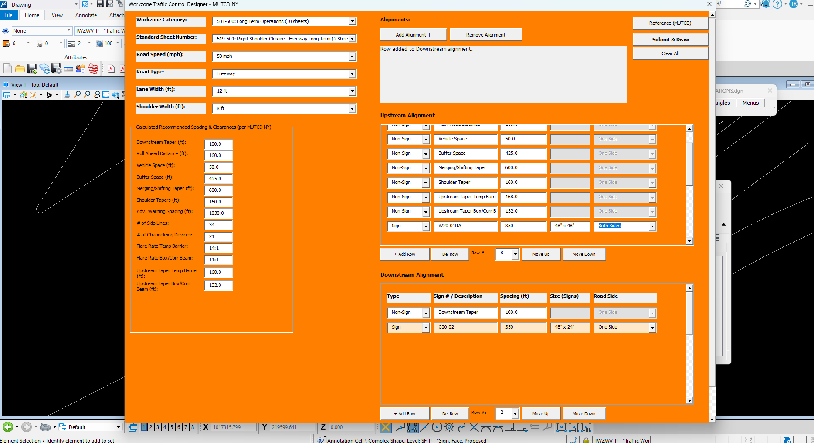
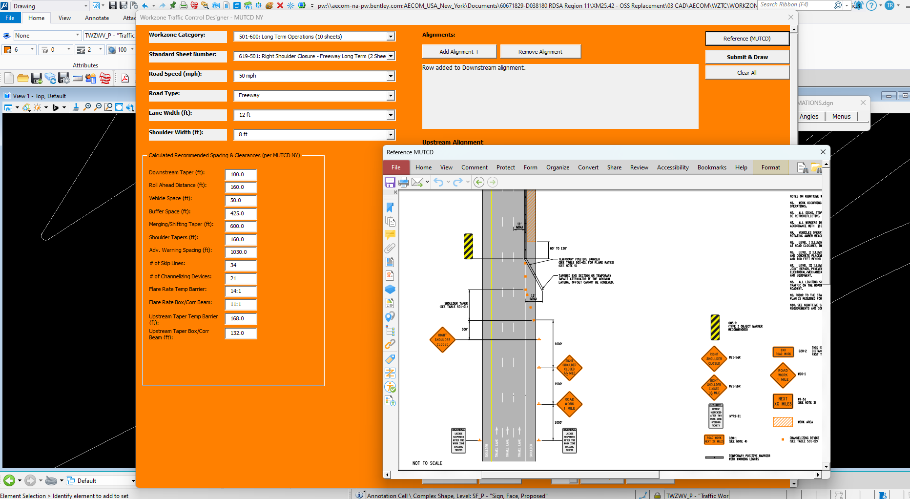
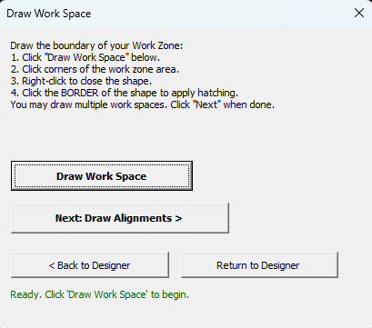
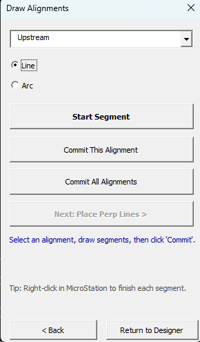
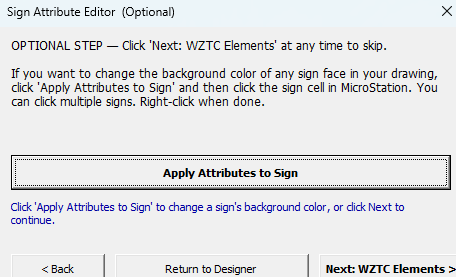
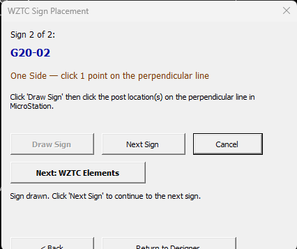
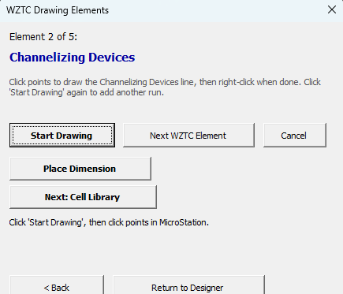
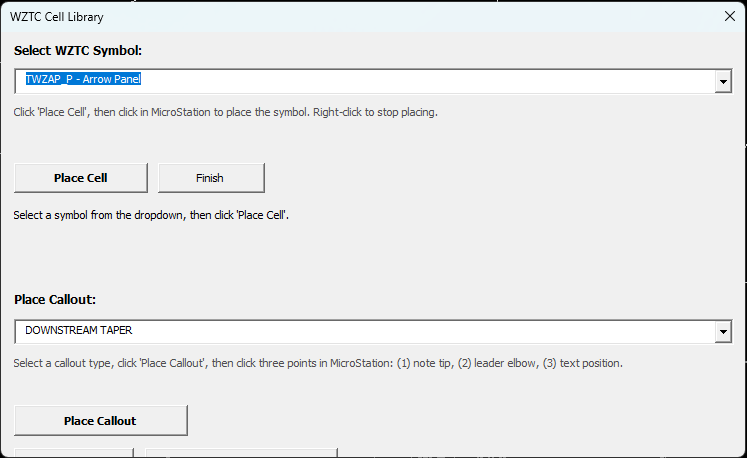

# NYSDOT Workzone Traffic Control Designer

A MicroStation tool that automates the creation of NYSDOT-compliant workzone traffic control plans. An AI agent lives inside MicroStation as a chat panel: describe the workzone in plain language, and it looks up the governing NYSDOT tables, lays out the corridor, and places every sign, taper marker, and element at the correct location — on the correct MicroStation level, with the correct spacing — while you watch it happen in the drawing.

---

## Why Use This Tool

Preparing a workzone traffic control plan by hand in MicroStation is time-consuming and error-prone. It requires:

- Looking up spacing values in the NYSDOT Part 619 standard sheets and tables based on speed, road category, lane width, and shoulder width
- Drawing in cumulative distances and dimensions from scratch for every sign, taper, buffer zone, and work area marker
- Manually placing each sign face cell, sign post cell, connecting line, and text label one at a time from the cell library
- Switching MicroStation levels by hand for each element type, then switching back
- Keeping track of which signs go where in the .dgn file

This tool automates all of that, and you drive it by describing what you need instead of clicking through a form:

**You describe the workzone, the agent does the lookups.** Tell it the road speed, lane width, shoulder width, and area type, and it pulls every required spacing value — downstream taper length, roll-ahead distance, vehicle space, buffer space, merging taper, shoulder taper — directly from the NYSDOT standard tables. It never guesses a number; every spacing, taper length, and sign size is traceable back to a PE-reviewed table.

**Built-in sign library with 500+ NYSDOT/MUTCD signs.** Mention a sign by number or description (for example, W20-01RA) and the agent resolves it to the correct cell, size (Freeway or Non-Freeway), and recommended spacing — including sheet-registry codes that don't match a library key one-to-one.

**Whole-sheet automation.** For sheets the agent has a machine-readable spec for (the NYSDOT Part 619 catalog, growing over time), it can build the entire station table, sign placement, dimensions, channelizing devices, and work-area hatch for that sheet from your road parameters — then check its own work for overlaps and table-crossing errors before you ever see it.

**Handles curved and complex corridors.** Roads with arcs, S-curves, ramp gores, divided highways, two-way-left-turn lanes, and orthogonal intersections are all supported — the agent walks the actual path geometry, not a straight-line approximation, so spacing and sign placement stay correct on a curve.

**Automatic element placement on the correct MicroStation levels.** Every element the agent places — sign faces, work space hatching, channelizing device lines, barriers, dimensions — goes on its correct NYSDOT level with the correct color and line weight automatically.

**It shows its work and asks when it's unsure.** The agent narrates what it's doing in the chat panel, takes its own screenshots to self-check placements, and stops to ask you — by text, button choice, or having you click a point in the drawing — whenever a decision needs engineering judgment rather than a table lookup.

**Repeatable, consistent results.** The same road parameters produce the same spacings and placements every time. There is no risk of forgetting a value or entering it in the wrong cell.

---

## How It Works — Talk to the Agent

The primary way to use this tool is the **in-MicroStation chat panel**. You no longer have to click through a sequence of forms — you describe the workzone and the agent plans and draws it.

1. Open MicroStation with your design file (units set to feet) and the `Test` VBA project loaded.
2. Run the macro **LaunchChatPanel** from the MicroStation VBA macro list. This opens the chat panel as a modeless window alongside your drawing.
3. On your machine (or whoever is running the agent process), make sure `chat_driver.py` is running — see [What You Need Before Starting](#what-you-need-before-starting). It's a separate small Python process that holds the actual agent; the panel itself just displays the conversation and forwards what you type.
4. Type what you need in plain language. For example:

   > "I need a right-lane closure on a two-lane rural highway, 55 mph, 12 ft lanes, 8 ft shoulders. Signs are W20-1, W20-4, and W20-7."

5. The agent will ask any clarifying questions it needs (area type, which side of the road, whether you want a specific 619 sheet followed exactly), then:
   - look up the required spacings and sign sizes from the NYSDOT tables,
   - draw or accept your alignment,
   - place the work space, signs, channelizing devices, and dimensions,
   - take a screenshot and visually check its own layout for overlaps or errors,
   - tell you what it did and what (if anything) it couldn't finish automatically.
6. If it queues anything for you — a dimension or callout that needs a few interactive clicks — it will tell you plainly what's left and where.

You can also ask it to explain a spacing value, pull up a standard sheet for reference (`open_sheet_viewer` / `open_sheet_pdf`), search the MUTCD/NYSDOT manuals for a rule, or make edits to elements it already placed ("move that sign 20 ft downstream," "change that barrier's level").

### Two modes, one agent

The agent starts in **general mode** — general MicroStation drawing, editing, and query capability, no WZTC-specific rules loaded. As soon as you start describing a workzone task, it switches itself into **wztc mode** (you'll see "— Switched to wztc mode —" in the transcript) and gains the spacing/sign/sheet tools and the NYSDOT rules that govern them. Modes stack — entering wztc mode never takes away its general drawing ability, it only adds the domain-specific layer on top.

---

## What the Agent Can Do

| Capability group | What it covers |
|---|---|
| **Workzone engineering lookups** | Spacing/taper calculations, sheet requirements, sign-code resolution, sheet lateral offsets, station cross-validation — all sourced from PE-reviewed NYSDOT tables, never invented |
| **Corridor & road building** | Straight, curved, and S-curve alignments; lane, two-way, divided, and two-way-left-turn highways; orthogonal intersections; ramp gores; work-area placement and snapping along a path |
| **Sign & element placement** | Full four-part sign assembly (face, post, line, label) in one step, work space hatch, channelizing devices, barriers, removal striping, dimensions (including curved/arc dimensions), text labels and callouts |
| **Whole-sheet automation** | Builds an entire 619 standard sheet layout from your road parameters against a machine-readable sheet spec, including a sandboxed preview you can review before it's committed to your drawing |
| **Quality checks** | Visual QA screenshots the agent actually looks at, an overlap checker, a geometry scorecard, and station cross-validation — run automatically after a build |
| **General CAD tools** | Lines, arcs, circles, polygons, hatching, fillets, arrays, mirroring, moving/copying/rotating/scaling elements, level and symbology changes — available even outside a WZTC task |
| **Reference lookup** | Full-text search over the MUTCD and NYSDOT standard sheet PDFs, with the actual matched page shown in the panel |
| **Session tools** | Undo of its own most recent action, a full journal of everything it's placed, drawing-state and cell-library queries, view/zoom control, screenshot capture |

Everything the agent draws is placed on the correct NYSDOT level, color, and line weight for that element type automatically — the same level/color/weight table the tool has always used.

---

## Automated Sheet Builds

For sheets in the NYSDOT Part 619 catalog that have a machine-readable spec (`Data/sheet-specs/`), you can ask the agent to build the whole sheet rather than assembling it piece by piece. Give it your road parameters — speed, lane width, shoulder width, area type, and the corridor geometry — and it will:

1. Work through the sheet's governing tables (protective vehicle, buffer/taper lengths, advance-warning spacing, sign sizes) and hard constraints (e.g. "no occupancy in the buffer/roll-ahead," "shoulder taper is an overlay, not a sequential station," valid speed range) exactly as specified for that sheet.
2. Build the station table, place signs, dimensions, channelizing devices, work-area hatch, and labels in the corridor's zone order.
3. Build it first in a **sandbox** — an offset scratch area — so you can review the layout before it lands in your real drawing. You choose to keep it or discard it.
4. Run its own quality checks (overlap detection, geometry scorecard, station cross-validation) and take screenshots it inspects itself, retrying if something looks wrong.

This coverage grows sheet by sheet as specs are added; ask the agent which sheets it currently has full-build support for.

---

## Where You Stay in the Loop

The agent is built to hand judgment calls back to you, not to guess:

- **It never invents a spacing, taper length, or sign size.** Those numbers only ever come from the NYSDOT tables via its lookup tools — if a value isn't in a table, it will say so rather than estimate one.
- **A few operations require your click.** Certain MicroStation commands (dimension placement, callout text) can't be driven headlessly and are queued for you. The agent tells you plainly what's left to finish by hand.
- **It asks when something is a judgment call**, not a table lookup — by text, by offering you a short list of concrete choices, or by asking you to click a point or element directly in the drawing.
- **Sheet builds preview in a sandbox first** so nothing lands in your real drawing without you seeing it.
- **Every placement is undoable and logged.** The agent can undo its own most recent action, and every operation it performs — with the reason it gave for doing it — is recorded so you (or it) can review the history of a session.

---

## What You Need Before Starting

**To run the in-MicroStation chat agent (what the field/design engineer uses):**

- MicroStation CONNECT Edition (2023 recommended), design file units set to **feet**
- NYSDOT ProjectWise WorkSpace mounted locally, which provides the sign face cells (`ny_plan_nmutcd_signface.cel`) and WZTC symbols (`ny_plan_wztc.cel`)
- The `Test` VBA project loaded with the current modules from this repo, including `UserForms/WZTCChatPanel.frm` and `Modules/WZTCChatTimer.bas`
- Python 3.10+ with `pip install -r mcp-server/requirements.txt`, and an `ANTHROPIC_API_KEY` available (environment variable, `ant auth login` profile, or `mcp-server/.env`)
- `chat_driver.py` running (`python mcp-server/chat_driver.py`, or `python mcp-server/restart_chat_driver.py` to relaunch it after an update) — it is a separate process from MicroStation and is not auto-started
- The panel itself is opened from the MicroStation VBA macro list — run the macro **LaunchChatPanel**

**To use this project's tools from Claude Code instead (developer/automation use, not the field workflow):**

```
claude mcp add wztc-designer -- python "c:\repos\microstation-vba-project\mcp-server\server.py"
```

This registers the same underlying tool surface as an MCP server for Claude Code. It's a separate integration path from the chat panel above — useful for developing this project or automating it from Claude Code, not what an engineer uses day to day in MicroStation.

---

## Manual Fallback — the 8-Step Wizard

The original click-through wizard is still in the repo and still works if you'd rather not use the chat agent, or if the agent queues something that's easier to finish by hand. It walks you through the same sequence the agent now performs automatically: Designer → Draw Work Space → Draw Alignment → Place Reference Lines → (optional) Sign Attribute Editor → Place Signs → Draw Elements → Cell Library. Launch it from the MicroStation VBA macro list with the macro **LaunchWZTC**.

This path is no longer where new capability is being added — curved roads, corridor assembly, and whole-sheet automation are agent-only for now — but every level/color/weight rule and every spacing table it uses is the same one the agent uses, so results from either path are consistent.


*The Designer window from the manual wizard. Road parameters are on the left, calculated spacings in the center panel, and the Upstream and Downstream alignment tables on the right.*

<details>
<summary>Full manual wizard walkthrough (8 steps, click to expand)</summary>

### Step 1 — Configure Your Workzone (Designer Window)

Select your category, road speed, road type (Freeway/Non-Freeway), lane width, and shoulder width, then click **Calculate Spacing** to fill in every required spacing value from the NYSDOT tables. Add signs to the Upstream/Downstream alignment tables by number (for example `W20-01RA`) — the library auto-fills size and spacing. Click **View Standard Sheet** at any time to open the governing 619 sheet in MicroStation as a reference. Click **Submit** when done.


*The built-in 619 standard sheet viewer, open alongside the Designer window as an in-drawing reference.*

### Step 2 — Draw the Work Zone Boundary (Draw Work Space Window)

Click **Draw Work Space**, click the corners of your boundary, right-click to close the shape, then click the **border** of the shape to apply the hatch fill. Placed automatically on level TWZWS2_P.



### Step 3 — Draw the Alignment (Draw Alignment Window)

Draw line or arc segments for your centerline; each connects to the end of the previous one. Switch alignments via the dropdown and commit each with **Commit This Alignment** (or commit all at once). Drawn on the Default level in white as a construction reference.



### Step 4 — Place Reference Lines (Place Reference Lines Window)

The tool walks the alignment and proposes an 80-ft perpendicular tick line at the correct calculated distance for each item in sequence. **Place Line** to accept, **Skip** to omit.

### Step 5 — Sign Face Background Color (Optional)

Optional attribute pass for sign faces already in the drawing — click **Apply Attributes to Sign**, then click each sign. Skip straight to Step 6 if not needed.



### Step 6 — Place Sign Graphics (Place Signs Window)

For each sign with a placed tick line, click **Draw Sign** and click the post location — the tool places the face cell, post cell, connecting line, and text label in one operation. Click **Next Sign** to advance.



### Step 7 — Draw Remaining Elements (Draw Elements Window)

Cycles through Channelizing Devices, Removal Striping, Temporary Barrier, and Barrier with Warning Lights: **Start Drawing**, draw, right-click to finish, **Next WZTC Element**. **Place Dimension** adds annotations.



### Step 8 — Place Symbols and Callouts (Cell Library Window)

Place remaining WZTC symbols (arrow panels, flaggers, crash cushions, etc.) and text callouts. **Finish** deletes the perpendicular reference tick lines from Step 4, leaving only the final plan elements.



</details>

---

## Tips

- **Ask, don't guess.** If you're not sure what the agent needs from you, just ask it — it will tell you what information or drawing input it's waiting on.
- **Multiple runs:** If you need to redo a section, tell the agent what to change; it can move, re-level, or delete elements it placed itself. For a bigger rework, it's often simplest to delete the affected elements and ask it to rebuild that portion.
- **Cell library path:** The tool requires the NYSDOT ProjectWise WorkSpace to be mounted at the standard local path. If sign cells or WZTC symbols don't appear, confirm your ProjectWise WorkSpace is active and connected.
- **Curved alignments:** The agent measures distance along the actual path, including arcs — ask it to show you current stationing along the alignment if you want to verify placement.
- **Sandbox builds:** For a full sheet build, ask to see the sandbox result before committing it if you want a chance to review first.
- **Sign lookups:** You can reference a sign by its printed sheet code even if it doesn't match a sign library key exactly — the agent resolves the mapping and will tell you if a code is ambiguous or not yet in the library.

---

## Worked Example — Shoulder Closure on a Rural Highway

**Scenario:** A contractor needs to close the right shoulder of a 45 mph, two-lane rural highway (Non-Freeway) for guardrail replacement. The lanes are 12 ft wide and the shoulder is 8 ft wide. The required signs are W20-01RA (Road Work Ahead) and R02-01 (One Lane Road Ahead).

---

**In the chat panel:**

> **Engineer:** Shoulder closure, right side, 45 mph, non-freeway, two-lane rural highway. 12 ft lanes, 8 ft shoulder. Need W20-01RA and R02-01. Guardrail replacement, about 400 ft of shoulder.

The agent switches into wztc mode, then works through the required spacings against the NYSDOT tables:

| Item | Spacing |
|------|------|
| Shoulder Taper | 80 ft |
| Buffer Space | 350 ft |
| Vehicle Space | 100 ft |
| Roll Ahead Distance | 100 ft |
| Merging/Shifting Taper | 0 ft *(not required for shoulder closure)* |

It confirms the alignment — asking you to click a start and end point along the highway centerline if one isn't already drawn — then walks it, placing:

- the work space hatch over the closed shoulder area on TWZWS2_P,
- W20-01RA (350 ft) and R02-01 (100 ft) with full four-part sign assemblies at the correct positions,
- channelizing devices along the shoulder edge on TWZCD_P,
- shoulder-taper removal striping on TWZPMRC_P,
- a dimension annotating the 350 ft buffer space.

It then takes a screenshot, checks the layout for overlaps, and reports back:

> **Agent:** Placed the shoulder closure per the spacing table above. One item needs your input: a callout for channelizing device spacing ("CHANNELIZING DEVICES SPACED @ 20' O.C.") — dimension/callout text has to be placed interactively, so I've queued it. Want me to also place a Type III Barricade at the closed shoulder entrance?

You confirm the barricade placement and finish the callout yourself in a few clicks.

**Total time:** A few minutes of conversation for a plan that would typically take 2–3 hours to produce manually.

---

## Design Notes

The following explains some choices made in how this tool works, in case you are troubleshooting or want to understand the behavior better.

**Why the agent never computes a spacing or sign size itself.** Every number that reaches the drawing comes from a lookup against PE-reviewed NYSDOT tables (`compute_spacing`, `get_sheet_requirements`, `resolve_sign_code`), never from the model's own estimate. This keeps every plan traceable to a standard sheet or table, the same guarantee the manual wizard always provided.

**Why sheet builds preview in a sandbox first.** A full sheet build touches many elements at once. Building it in an offset scratch area first, and only merging it into your real drawing once you've reviewed it, avoids having to hand-clean a bad build out of your live design file.

**Why some commands are queued instead of run automatically.** A handful of MicroStation commands (dimension placement, callout text entry) require an interactive click-through that can't be driven headlessly without risking a stuck/hung state. Rather than fake success, the agent queues these and tells you plainly what's left.

**Why the agent switches modes instead of always having every tool loaded.** Starting in a general, non-WZTC-specific mode keeps the agent's general MicroStation drawing/editing ability available for any task, and it only takes on WZTC-specific rules and tools once you're actually doing WZTC work — visibly, in the transcript, not as a hidden classifier decision.

**Why stored settings disappear if MicroStation closes.** Session state — including which mode you're in and the conversation history — lives with the running `chat_driver.py` process and the open drawing. If you need to continue a workzone plan in a later session, describe where you left off; the elements already placed in your drawing file are saved with the file and are not affected.

**Why undo only reverses the agent's own actions.** The agent's undo walks its own operation journal, not MicroStation's native undo stack, so it can only reverse elements it created or edited itself in that session — not manual changes you made independently.

**Why the alignment path sometimes places elements at slightly different positions than a straight-line estimate.** The agent measures distance along the actual drawn or synthesized path — including arcs — not a straight-line approximation. Ask it for current stationing along the alignment if you want to see exactly where it is.

**Why sign sizes and cell names are set by the tool, not by your active MicroStation settings.** Every element the agent places — sign faces, posts, levels, colors, line weights — uses settings defined in the tool itself, not whatever happens to be active in your MicroStation session. This prevents the common mistake of placing elements on the wrong level because a different level was active from a previous command.
